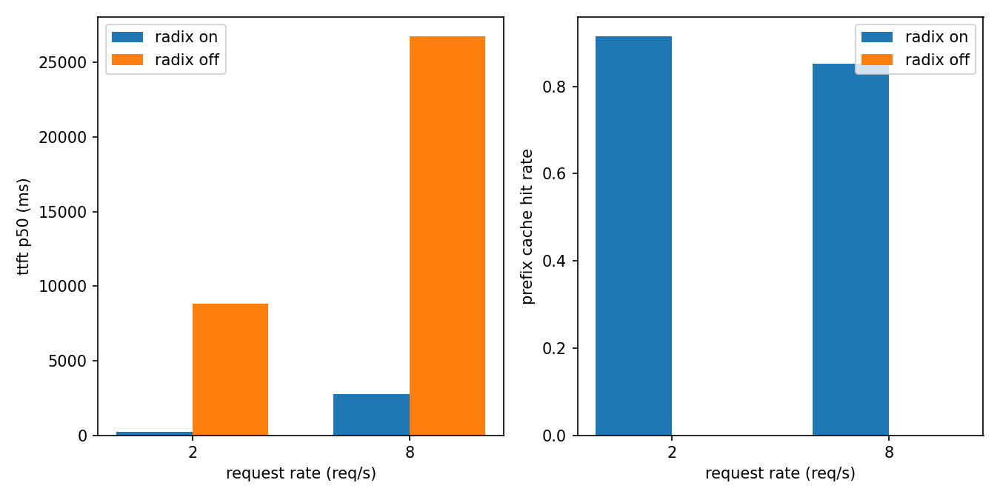

# clockwork

An LLM inference engine with continuous batching, a paged KV cache, and a radix prefix
cache behind an OpenAI-compatible API.

[](https://github.com/jasonjesuraja06/clockwork/actions/workflows/ci.yml)

Measured on a Tesla T4 by this repo's own harness: 1.17x to 2.38x vLLM output throughput on 12
self-designed synthetic agent traces, p99 ttft down 77% from the prefix cache, 8.3x peak Triton
speedup, greedy decoding token-exact vs Hugging Face.

## Motivation

Agent loops resend the same system prompt, tool schemas, and history every turn, so most prompt
tokens reaching the server carry KV that was already computed. Continuous batching keeps the device
busy across uneven request lengths, paged KV storage turns cache memory into fixed-size blocks
shared and reclaimed per block, and a radix prefix cache resolves the repeated prefix to a
block-table lookup instead of a prefill, targeting time to first token on that traffic.

## Architecture

```
client
  |  POST /v1/chat/completions (SSE streaming)
  v
server (FastAPI) --> AsyncLLMEngine --> LLMEngine.step()
        |
        v
    scheduler <----- match / release ------> radix prefix cache
        |  decode first, FCFS admission,         |  incref + lock
        |  preemption by recompute               |  matched blocks
        v                                        v
    block manager ------------------------> block allocator (refcounts, CoW, LIFO free list)
        |  block tables, slot mappings
        v
    model runner -------------------------> paged KV cache
        |  per-sequence prefill, batched decode  [num_blocks, block_size, kv_heads, head_dim]
        v
    Qwen2 model --> attention kernels (torch reference, Triton paged decode)
```

## Measured results

Correctness, measured on the build host (float32, cpu):

| check | value |
| --- | --- |
| tiny-model max abs logit diff vs Hugging Face | 2.98e-07 |
| paged prefill vs dense attention, max abs diff | 0.0 |
| paged decode vs dense attention, max abs diff | 2.05e-07 |
| Qwen2.5-1.5B-Instruct greedy decoding vs Hugging Face | PASS, exact token match |

Performance, measured on a Tesla T4 (float16, CUDA 12.8) by `notebooks/bench_t4.ipynb`:

| measurement | value |
| --- | --- |
| Triton vs torch paged decode | faster on 11 of 12 shapes, up to 8.3x |
| prefix cache, cold trace versus identical warm replay | ttft p50 down 49%, p99 down 77% |
| radix ablation, identical agent trace | 1.42x to 2.03x output tok/s, ttft p50 down 91 to 98% |
| agent-trace prefix hit rate | 0.83 to 0.91 |
| mean output tok/s vs vLLM, 12 self-designed agent traces | 245.2 vs 168.7, 12 of 12 (1.17x to 2.38x) |
| mean output tok/s vs vLLM, 5 synthetic single-turn workloads | 318.0 vs 337.1 |
| peak output tok/s | 499.0 (synthetic single-turn at 16 req/s) |

Read the vLLM row as scoped: those 12 agent traces are self-designed by this project, and their
long shared prefixes are the structure this engine exists to exploit, so the comparison favors
clockwork by construction. The 5 single-turn rows came from a seeded synthetic length sampler, not
the ShareGPT dataset, because the run had no `data/sharegpt.json`. Both engines were driven by this
repository's own harness; no independent tool has corroborated any of it. Full disclosure and
tables: `docs/results.md`.



## Quickstart

Requires [uv](https://docs.astral.sh/uv/).

```
uv sync
uv run pytest -q -m "not slow"
uv run pytest tests/test_hf_equivalence.py -q -m slow
uv run clockwork-serve --config configs/qwen2.5-1.5b-instruct.yaml  # cpu; -cuda.yaml for a GPU host
```

The first pytest command downloads nothing and covers what CI runs (CI also deselects gpu-marked
tests, which skip without CUDA); the second downloads Qwen2.5-1.5B-Instruct for the exact-match
gate. With the server up:

```
curl http://127.0.0.1:8000/v1/chat/completions -H "Content-Type: application/json" -d '{
  "model": "Qwen/Qwen2.5-1.5B-Instruct", "max_tokens": 32,
  "messages": [{"role": "user", "content": "Name the largest planet in the solar system."}]}'
```

## Evaluation protocol and limitations

The equivalence gate loads identical weights into clockwork and Hugging Face transformers, runs
both in float32 on cpu, and requires greedy decoding to produce the same token at every step; on
the tiny config, full logits must also agree within atol and rtol 1e-5. CI runs the gate on a tiny
random-weight Qwen2 config, the slow marker on the real checkpoint. The bench harness drives seeded
workloads against the server over HTTP and measures TTFT and inter-token latency percentiles,
output tok/s, and radix hit rate from the server's own usage accounting. Internals: `docs/design.md`.

Model family: the engine implements the Qwen2 architecture and the loader rejects any checkpoint
whose `model_type` is not `qwen2`. The brief asks for Llama 2/3 or Mistral weights;
Qwen2.5-1.5B-Instruct is the default because it needs no gated download, so anyone can reproduce
the gates. Supporting Llama or Mistral means adding that model class, not repointing a config.

Limitations: one model per process on a single GPU, no speculative decoding, no tensor
parallelism, no quantization. Prefill is per sequence without chunking, so admissible prompts are
capped at `max_num_batched_tokens` (4096 in the shipped config); the server rejects longer prompts
with a 400. The throughput win is specific to concurrent agent traffic: vLLM leads on the
single-turn rows, on inter-token latency nearly everywhere, and on fixed-length single-session
completion. On the build host (macOS, no CUDA) the Triton kernel is validated by a line-for-line
torch transliteration; on the T4 the gpu-marked kernel tests pass against the torch reference.

## License

MIT
